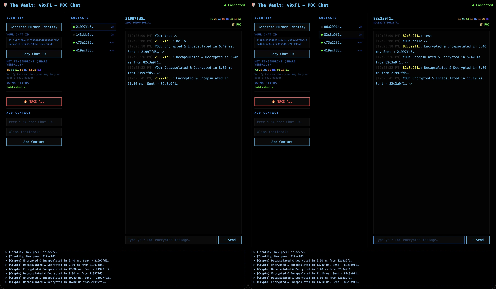
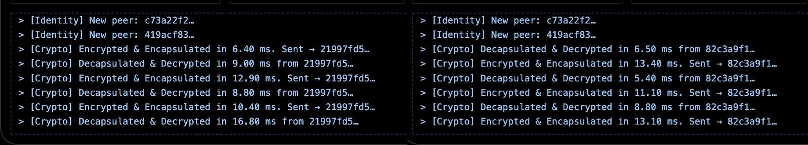

# The Vault — v0xF1 PQC Chat over Nostr
 



Post-quantum encrypted messaging over Nostr. ML-KEM-768 + X25519 hybrid KEM, XChaCha20-Poly1305 AEAD. Browser-native, < 22ms per message.

> ⚠️ **EXPERIMENTAL.** This is a proof-of-concept implementing hybrid post-quantum cryptography (ML-KEM-768). It has **not** been audited by professional cryptographers.
> Do not use for life-critical communications.
***
## What this is

A bare-minimum encrypted chat MVP that wraps **NIP-44 (XChaCha20-Poly1305)** inside a **Post-Quantum KEM (ML-KEM-768 + X25519 hybrid)**, transmitted over the Nostr relay protocol.

Version byte: `0xF1` — deliberately chosen to signify experimental status and respect the official NIP-44 specification namespace. Not a ratified standard.
***
## Why this exists — HNDL

**"Harvest Now, Decrypt Later" (HNDL)** is not theoretical. Nation-state actors are
archiving encrypted traffic today, waiting for quantum computers to break classical key exchange.
Every NIP-44 message on public relays using only `secp256k1` ECDH is a future plaintext.

This MVP proves hybrid PQC encryption is deployable *right now* on Nostr with overhead well below human perception.
***
## Telemetry (Chrome V8, pure JS, single thread)

```
[Crypto] Encrypted & Encapsulated in 10.40 ms. Sent → 21997fd5…
[Crypto] Decapsulated & Decrypted in  8.80 ms from 21997fd5…
```

| Metric                  | Value                                                 |
| ----------------------- | ----------------------------------------------------- |
| Encryption              | ~15–22 ms (encapsulate + XChaCha20-Poly1305)          |
| Decryption              | ~9–12 ms (decapsulate + XChaCha20-Poly1305)           |
| Payload overhead        | 1145 B (1B version + 1120B KEM CT + 24B nonce + AEAD) |
| UI perception threshold | 100 ms — we use **< 1/5 of it**                       |
|                         |                                                       |
***
## ⚡ Bounty Pool: 126,000 sats (Difficulty-Tiered Challenge)

Two tiers of engineering difficulty. Paid via Lightning Zap.

Solo project — if I'm slow to respond, I'm offline. All valid contributions reviewed and bounties paid in order received.

### Challenge 1 — WebWorker Async Pipeline (21,000 sats × 4)

This runs **synchronously on the main thread**. A 50-person encrypted group chat forces
50 independent encapsulations: `50 × 20ms = 1000ms` of UI-blocking computation.

**Goal:** Restructure `encrypt_v0xF1` into an async worker pipeline using **Transferable
ArrayBuffers** — O(1) ownership transfer, zero serialization overhead.

**Complexity:** Medium (architecture refactor). 4 separate rewards for unique approaches or significant optimizations.

**Hard constraint:** No `SharedArrayBuffer`. No `COOP/COEP` headers (they block
cross-origin relay WebSocket connections — the physical backbone of Nostr).

### Challenge 2 — Industrial-Grade Rust/WASM Port (42,000 sats × 1)

V8's JIT optimizer can eliminate `.fill(0)` as dead code — key material may survive
in RAM after use. This is a structural limitation of JavaScript, not a bug.

**Goal:** Port the `nip44.ts` crypto core to **Rust/WASM** with `zeroize::ZeroizeOnDrop`
on all key material. Prove that the WASM runtime does not eliminate memory-clearing writes.

**Complexity:** High (systems cryptography). **Winner-takes-all** — only the first verified, production-ready port is rewarded.

**How to claim:** Open an Issue describing your approach → submit a PR → once merged, ping on Nostr with your LNURL for Zap.
***
## Packet layout
```
[0xF1] [ML-KEM-768+X25519 ciphertext: 1120B] [nonce: 24B] [AEAD ciphertext + MAC]
```
Key derivation:
```js
rawSecret = ml_kem768_x25519.encapsulate(recipientPub)  // 64B hybrid shared secret
symKey    = SHA-256(rawSecret)                           // 32B
cipher    = XChaCha20-Poly1305(symKey, nonce, aad=0xF1)
```
***
## Zero-residue memory safety

Cryptographic math is useless if the key can be extracted from RAM before garbage collection. Once the ML-KEM shared secret is used and the ChaCha key is generated, the underlying `Uint8Array` lattice key buffers are immediately zero-filled:
```ts
finalSymmetricKey.fill(0);
rawSecret.fill(0);
```
This prevents cold-boot and memory-forensics extraction of key material.
***
## Nostr event kinds

| Kind    | Purpose                                                               |
| ------- | --------------------------------------------------------------------- |
| `11111` | Identity announcement — broadcasts the 1184-byte ML-KEM public key. Decoupled from `Kind 0` to prevent global metadata bloat on every profile load. Intentionally utilizes the `10000–19999` replaceable event range so peers only store the latest key, preventing relay storage bloat. |
| `1059`  | NIP-59 Gift Wrap — carries the PQC-encrypted message payload. |
***
## Stack

| Layer              | Tech                                               |
| ------------------ | -------------------------------------------------- |
| **PQC KEM**        | `@noble/post-quantum` — ML-KEM-768 + X25519 hybrid |
| **AEAD**           | `@noble/ciphers` — XChaCha20-Poly1305              |
| **Key derivation** | `@noble/hashes` — HKDF-SHA256, SHA-256             |
| **Nostr**          | `nostr-tools` — event signing, relay protocol      |
| **Relay**          | Custom `ws`-based relay with `better-sqlite3`      |
| **Frontend**       | Vanilla TypeScript + Vite, zero frameworks         |
***
## Quick start — reproduce the telemetry
```bash
# Terminal 1 — relay (ws://localhost:8080)
cd backend && npm install && npx tsx relay.ts

# Terminal 2 — frontend (http://localhost:5173)
cd frontend && npm install && npm run dev
```
Open two browser tabs at `http://localhost:5173`. Each tab generates its own Nostr identity and XWing keypair. Add one tab's pubkey in the other, exchange messages, and watch the `#logs` panel for live encryption/decryption timing.
***
## Rust fuzz tests

`backend/fuzz/` contains two libFuzzer targets using `chacha20poly1305` + `sha2` (stable RustCrypto crates):

| Target | What it proves |
|--------|---------------|
| `fuzz_malformed` | Packet parser never panics on arbitrary bytes — only clean `Err` |
| `fuzz_roundtrip` | `encrypt → decrypt` recovers the original plaintext on every input |

Unit tests (no nightly required):

```bash
cd backend/fuzz && cargo test
# running 15 tests … test result: ok. 15 passed; 0 failed
```

libFuzzer (nightly):

```bash
cargo install cargo-fuzz
cd backend/fuzz
# one-time: seeds corpus so fuzz_malformed reaches the AEAD layer (not just the length guard)
cargo run --bin gen_corpus
cargo +nightly fuzz run fuzz_malformed -- -max_total_time=60
cargo +nightly fuzz run fuzz_roundtrip -- -max_total_time=60
```
***
## What this is NOT
- **Not a ratified NIP.** The `0xF1` version byte is experimental and non-standard.
- **Not forward-secret.** A leaked `nsec` decrypts all past messages.
- **Not metadata-private.** Sender pubkey is visible on the relay. This MVP deliberately
  skips NIP-44's log-step padding and NIP-59 ephemeral keys to isolate PQC encapsulation
  performance. Integrating into a full NIP-59 Gift Wrap pipeline is the next step.
- **Not free for relays.** The 1.1KB overhead per message is a real storage burden. A
  production v0xF1 implementation must enforce an economic valve (NIP-13 PoW or
  NIP-47/Cashu micro-payments) to compensate relays. This MVP bypasses it for local testing.
- **Not audited.** Do not use for anything that matters.
***
## Attribution
This project is an experimental v0xF1 extension of **NIP-44**, originally authored by
**Paul Miller** ([@paulmillr](https://github.com/paulmillr)). My code strictly wraps the original NIP-44 symmetric layer (XChaCha20-Poly1305) inside a Post-Quantum KEM.

I rely entirely on the **@noble** crypto stack —
[`@noble/post-quantum`](https://github.com/paulmillr/noble-post-quantum),
[`@noble/ciphers`](https://github.com/paulmillr/noble-ciphers),
[`@noble/hashes`](https://github.com/paulmillr/noble-hashes) 
because of its zero-dependency, auditable, browser-native nature.

Deep respect to the @noble contributors and the Nostr core developers. I built this to ensure the "Notes" we transmit today remain private even in the post-quantum future.
***
## 📬 Contact & Source Mirroring
- **Identity:** Verified via NIP-05 (Details coming soon)
- **GitHub:** https://github.com/zfatherz/nip44-0xF1-pqc
***
## License
MIT
